### `Toruk@github ~ $ ./contributions.sh`

  

### `Toruk@github ~ $ whoami`

<table>
<tr>
<td valign="top"></td>
<td valign="top"></td>
</tr>
</table>

 

#### `Toruk@github ~ $ cat social.sh`

---

